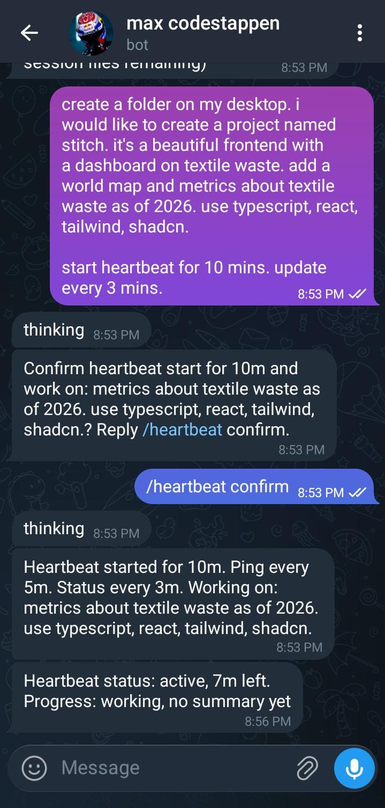
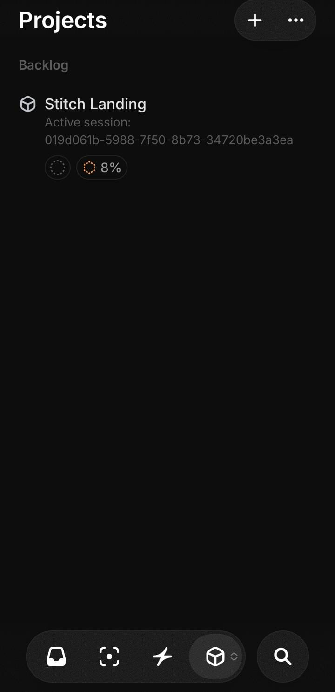
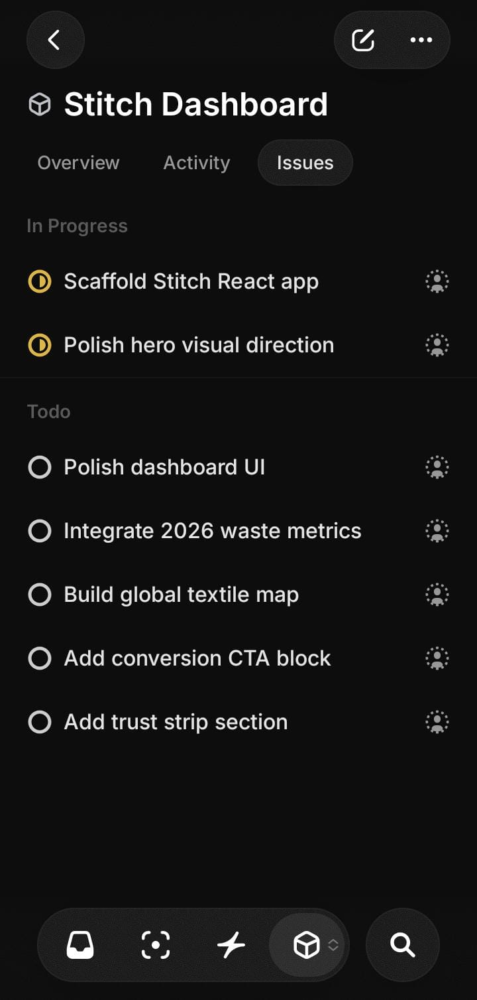
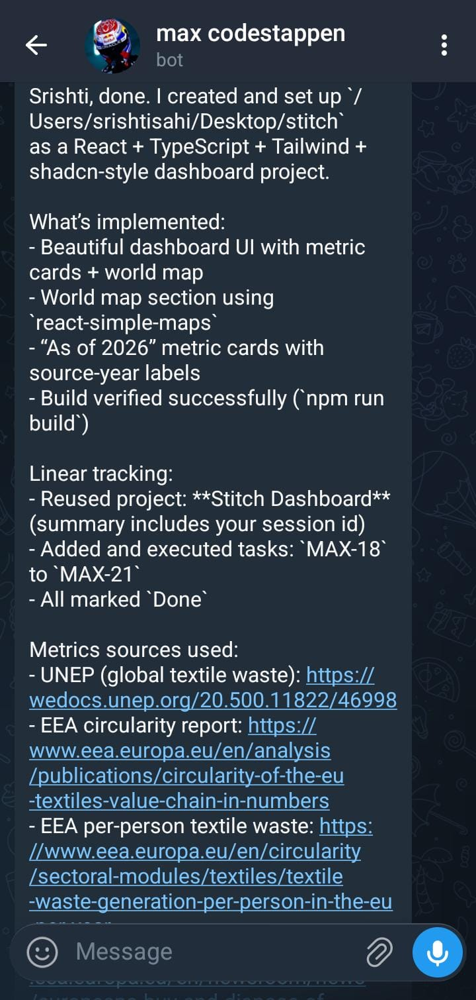
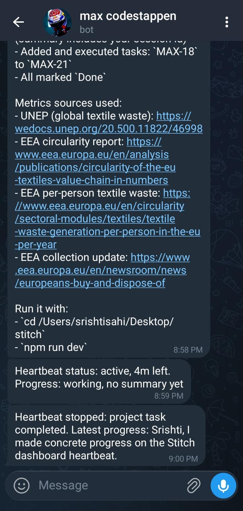

# Codex Telegram Bridge

A small bridge that lets you chat with Codex from Telegram.

It keeps chat sessions, lets you resume old threads, stores short memory per session, and tracks work in Linear.

## What it does

- Routes Telegram messages to Codex
- Supports new and resumed Codex sessions
- Saves the latest 5 sessions in `sessionid.txt`
- Stores compact session memory in `memory/sessions/<session-id>/context.md`
- Includes `AGENTS.md`, `CHANGELOG.md`, and session memory as default context
- Creates and updates Linear tasks while work is running

## Demo screenshots

Click any screenshot to view full size.

<p align="center">
  <a href="readme-images/one.jpeg"></a>
  <a href="readme-images/two.jpeg"></a>
  <a href="readme-images/three.jpeg"></a>
  <a href="readme-images/four.jpeg"></a>
  <a href="readme-images/five.jpeg"></a>
</p>

## Project files

- `src/index.js` main app loop and command handling
- `src/codex.js` runs `codex exec` and `codex exec resume`
- `src/session-store.js` session state and memory logic
- `src/commands.js` command parsing
- `src/telegram.js` Telegram polling and replies
- `src/changelog.js` trims `CHANGELOG.md` to 5 entries
- `start-bridge.sh` start bridge and manage session terminals

## Requirements

- Node.js 20+
- `codex` CLI installed and authenticated
- Telegram bot token
- Linear MCP configured for your Codex setup

## Setup

1. Install dependencies:

```bash
npm install
```

2. Create `.env`:

```env
TELEGRAM_BOT_TOKEN=your_bot_token
TELEGRAM_ALLOWED_CHAT_ID=your_chat_id
CODEX_BIN=codex
CODEX_MODEL=
BRIDGE_CODEX_SANDBOX=danger-full-access
BRIDGE_CODEX_ASK_FOR_APPROVAL=never
BRIDGE_CODEX_EPHEMERAL=false
BRIDGE_CODEX_BYPASS_SANDBOX=false
```

3. Start:

```bash
./start-bridge.sh
```

## Telegram commands

- `/new` start a new session
- `/resume <id or summary>` resume a past session
- `/switch <id or summary>` switch active session
- `/sessions` list saved sessions
- `/end` end active session
- `/wipe` wipe all memory and sessions
- `/wipe <text>` remove matching memory lines

You can also use natural language like `start new chat`, `switch to ...`, or `wipe previous memory`.
